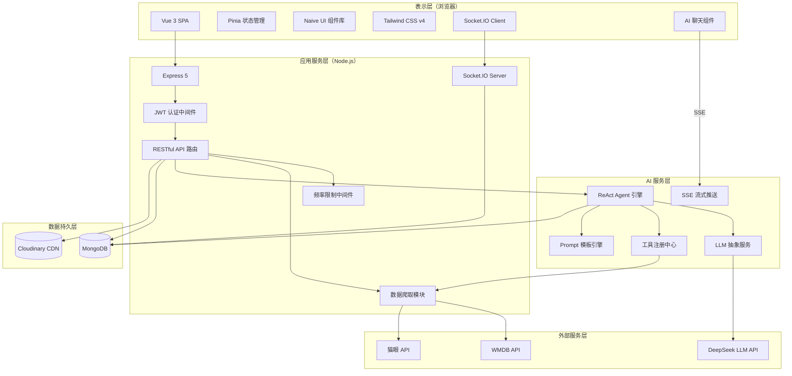
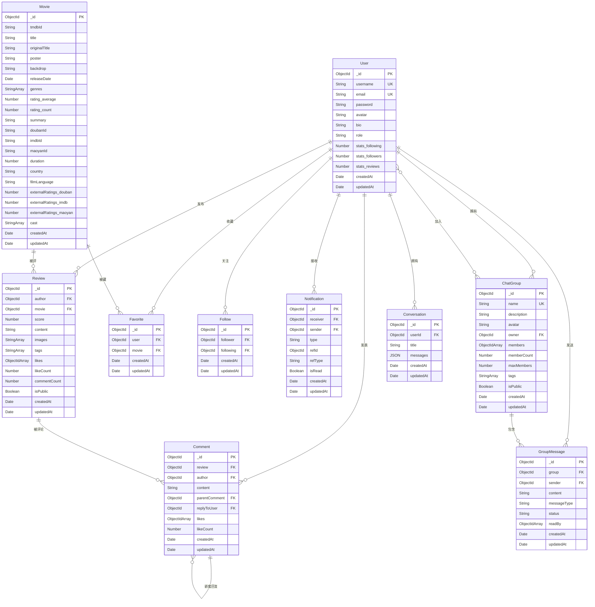
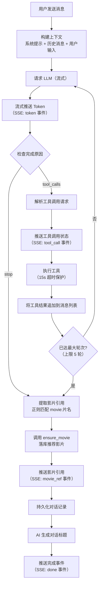
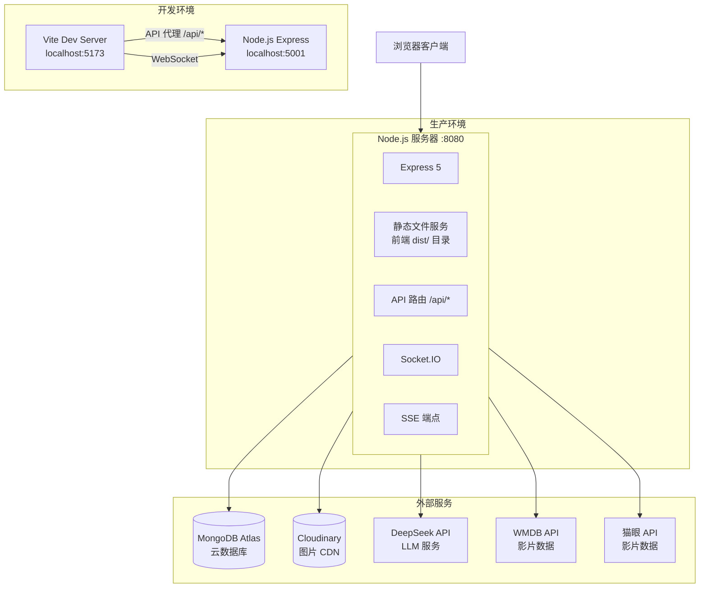
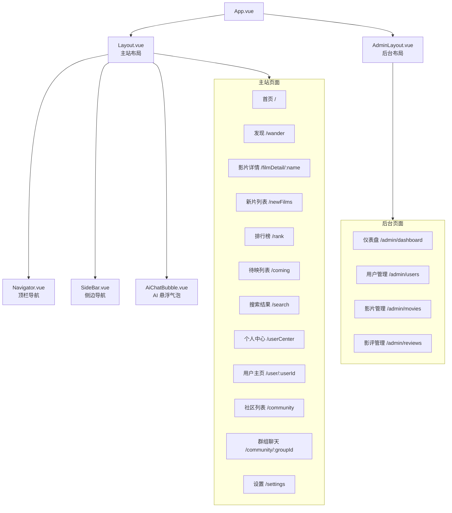
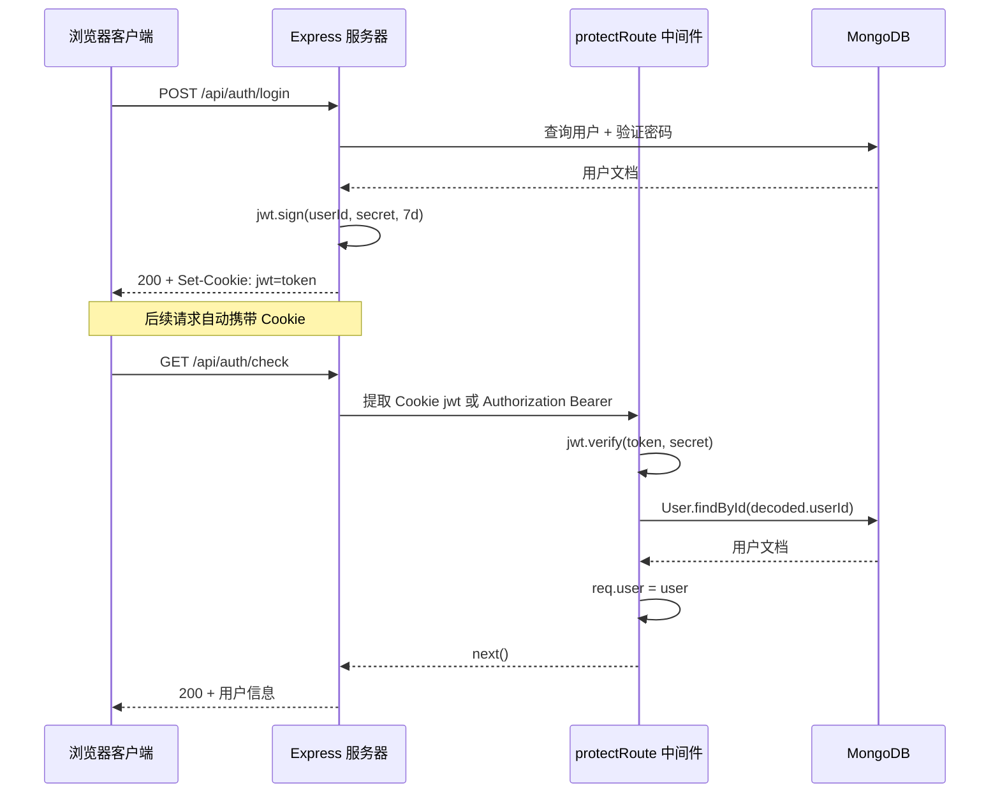

# Durian Movie 影视社区平台——系统分析与概要设计

---

## 第一章 系统概述

### 1.1 项目背景

随着互联网影视产业的快速发展，用户对于影视内容的获取与社交互动需求日益增长。传统的影视信息网站功能单一，缺乏社交互动与智能推荐能力，难以满足用户在"发现好片—表达观点—社交交流"全链路上的综合诉求。与此同时，大语言模型（LLM）技术的成熟使得 AI 驱动的智能推荐成为可能，为影视社区平台的差异化竞争提供了新的技术路径。

基于上述背景，本项目设计并实现了 **Durian Movie**——一个集影视信息聚合、用户影评社区、实时群组聊天与 AI 智能推荐于一体的全栈 Web 应用平台。

### 1.2 项目目标

1. **影视信息聚合**：整合 WMDB（豆瓣代理）与猫眼两大外部数据源，提供影片搜索、热映榜单、待映预告等信息服务。
2. **影评社区互动**：支持用户发布影评、评论互动、点赞收藏，形成 UGC 内容生态。
3. **实时群组社交**：提供基于 WebSocket 的小组实时聊天功能，构建影迷同好社区。
4. **AI 智能推荐**：基于 ReAct Agent 架构接入大语言模型，通过 Function Calling 实现工具增强的智能影片推荐。
5. **管理后台**：为管理员提供用户、影片、影评的数据管理与统计概览能力。

### 1.3 系统功能概述

| 模块 | 功能概述 |
|------|----------|
| 用户模块 | 注册、登录、个人资料管理、关注/粉丝体系 |
| 影片模块 | 多源搜索、影片详情、收藏、按类型推荐 |
| 影评模块 | 发布影评、嵌套评论、点赞互动、热门榜单 |
| 社区模块 | 创建/加入小组、实时群聊、在线状态感知 |
| 通知模块 | 点赞、评论、关注等事件的实时通知 |
| AI 助手模块 | 自然语言对话、工具调用、流式推送、会话管理 |
| 管理后台 | 数据统计仪表盘、用户/影片/影评 CRUD 管理 |

---

## 第二章 需求分析

### 2.1 系统角色定义

系统定义了三类用户角色：

- **游客（未登录用户）**：可浏览影片信息、榜单、公开影评，但不能参与互动。
- **注册用户**：在游客基础上，可发布影评、评论点赞、收藏影片、加入小组聊天、使用 AI 助手。
- **管理员**：拥有后台管理权限，可管理用户角色、影片数据、影评内容，查看平台运营统计。

### 2.2 功能性需求

#### 2.2.1 用例图

```mermaid
flowchart LR
    Guest["游客"]
    RegUser["注册用户"]
    Admin["管理员"]

    subgraph MovieInfo ["影片信息"]
        SearchMovie["搜索影片"]
        ViewDetail["查看影片详情"]
        ViewRank["查看排行榜"]
        ViewNowShowing["查看正在热映"]
        ViewComingSoon["查看即将上映"]
    end

    subgraph ReviewSys ["影评系统"]
        ViewReview["浏览影评"]
        WriteReview["发布影评"]
        LikeReview["点赞影评"]
        WriteComment["发表评论"]
        LikeComment["点赞评论"]
    end

    subgraph Social ["社交功能"]
        FavMovie["收藏影片"]
        FollowUser["关注用户"]
        JoinGroup["加入小组"]
        GroupChat["群组聊天"]
        ViewNotif["查看通知"]
    end

    subgraph AiModule ["AI 助手"]
        AiChat["智能对话"]
        AiRecommend["影片推荐"]
        ManageConv["管理会话"]
    end

    subgraph AdminSys ["管理后台"]
        ViewStats["运营统计"]
        ManageUser["管理用户"]
        ManageMovie["管理影片"]
        ManageReview["管理影评"]
    end

    Guest --> SearchMovie
    Guest --> ViewDetail
    Guest --> ViewRank
    Guest --> ViewNowShowing
    Guest --> ViewComingSoon
    Guest --> ViewReview

    RegUser --> SearchMovie
    RegUser --> ViewDetail
    RegUser --> ViewRank
    RegUser --> ViewNowShowing
    RegUser --> ViewComingSoon
    RegUser --> ViewReview
    RegUser --> WriteReview
    RegUser --> LikeReview
    RegUser --> WriteComment
    RegUser --> LikeComment
    RegUser --> FavMovie
    RegUser --> FollowUser
    RegUser --> JoinGroup
    RegUser --> GroupChat
    RegUser --> ViewNotif
    RegUser --> AiChat
    RegUser --> AiRecommend
    RegUser --> ManageConv

    Admin --> ViewStats
    Admin --> ManageUser
    Admin --> ManageMovie
    Admin --> ManageReview
```



#### 2.2.2 功能性需求清单

| 编号 | 需求名称 | 需求描述 | 角色 |
|------|----------|----------|------|
| FR-01 | 用户注册 | 用户通过用户名、邮箱、密码完成注册 | 游客 |
| FR-02 | 用户登录 | 通过邮箱和密码登录，获取 JWT 令牌 | 游客 |
| FR-03 | 资料管理 | 修改用户名、头像（Cloudinary 上传）、个人简介 | 注册用户 |
| FR-04 | 影片搜索 | 通过关键词搜索 WMDB 和猫眼影片数据库 | 全部 |
| FR-05 | 影片详情 | 展示影片基本信息、评分、演职员表、相关推荐 | 全部 |
| FR-06 | 榜单浏览 | 查看猫眼高分榜、正在热映、即将上映列表 | 全部 |
| FR-07 | 影片收藏 | 添加/取消影片收藏，查看个人收藏列表 | 注册用户 |
| FR-08 | 发布影评 | 对影片撰写评分（1-10）与文字影评，支持图片 | 注册用户 |
| FR-09 | 评论互动 | 影评下发表评论，支持嵌套回复 | 注册用户 |
| FR-10 | 点赞功能 | 对影评和评论进行点赞/取消点赞 | 注册用户 |
| FR-11 | 用户关注 | 关注/取消关注其他用户 | 注册用户 |
| FR-12 | 小组管理 | 创建、加入、退出兴趣小组 | 注册用户 |
| FR-13 | 实时群聊 | 基于 WebSocket 的小组内实时消息通信 | 注册用户 |
| FR-14 | 通知推送 | 点赞、评论、关注事件触发系统通知 | 注册用户 |
| FR-15 | AI 对话推荐 | 通过自然语言与 AI 助手对话获取影片推荐 | 注册用户 |
| FR-16 | 后台统计 | 查看用户数、影片数、影评数及趋势图 | 管理员 |
| FR-17 | 数据管理 | 用户角色变更、影片编辑/删除、影评删除 | 管理员 |

### 2.3 非功能性需求

| 类别 | 需求描述 |
|------|----------|
| 性能 | 首屏加载时间 < 3s；API 平均响应时间 < 500ms；AI 流式首 Token 延迟 < 2s |
| 安全性 | JWT + HttpOnly Cookie 双重认证；密码 bcrypt 加密；API 频率限制（10次/分钟）；CSP 安全头 |
| 可用性 | 响应式布局适配桌面端；Neobrutalist 设计风格保持一致性 |
| 可扩展性 | LLM 服务抽象层支持切换不同供应商；AI 工具注册机制支持扩展新工具 |
| 可维护性 | 前后端分离架构；模块化路由与控制器；Composable 封装复用逻辑 |

---

## 第三章 系统总体设计

### 3.1 系统架构设计

系统采用经典的 **前后端分离 B/S 架构**，整体分为表示层、应用服务层、AI 服务层、数据持久层和外部服务层五个层次。

#### 3.1.1 系统架构图



#### 3.1.2 架构层次说明

| 层次 | 职责 | 核心技术 |
|------|------|----------|
| 表示层 | 用户界面渲染、交互逻辑、状态管理 | Vue 3、Vite 7、Pinia 3、Naive UI、Tailwind CSS v4 |
| 应用服务层 | 业务逻辑处理、认证授权、实时通信 | Express 5、Socket.IO 4、JWT、bcryptjs |
| AI 服务层 | 智能推荐引擎、工具编排、流式响应 | OpenAI SDK、DeepSeek API、ReAct Agent、SSE |
| 数据持久层 | 数据存储与查询、文件托管 | MongoDB（Mongoose 9）、Cloudinary |
| 外部服务层 | 影视数据源、大语言模型接口 | WMDB API、猫眼 API、DeepSeek API |

### 3.2 技术选型

#### 3.2.1 前端技术栈

| 技术 | 版本 | 用途 |
|------|------|------|
| Vue 3 | 3.5 | 渐进式 JavaScript 框架，Composition API |
| Vite | 7.3 | 下一代前端构建工具 |
| TypeScript | 5.9 | 类型安全的 JavaScript 超集 |
| Pinia | 3.0 | Vue 官方状态管理库 |
| Vue Router | 5.0 | Vue 官方路由管理 |
| Naive UI | 2.43 | 高质量 Vue 3 组件库 |
| Tailwind CSS | 4.1 | 原子化 CSS 框架 |
| Socket.IO Client | 4.8 | WebSocket 客户端 |
| Lucide Vue Next | 0.563 | 图标库 |
| Marked | 18.0 | Markdown 渲染引擎 |

#### 3.2.2 后端技术栈

| 技术 | 版本 | 用途 |
|------|------|------|
| Node.js | >= 20.19 | JavaScript 服务端运行时 |
| Express | 5.2 | Web 应用框架 |
| Mongoose | 9.2 | MongoDB ODM |
| Socket.IO | 4.8 | WebSocket 服务端 |
| jsonwebtoken | 9.0 | JWT 令牌生成与验证 |
| bcryptjs | 3.0 | 密码哈希加密 |
| OpenAI SDK | 6.34 | LLM API 客户端（兼容 DeepSeek） |
| Cloudinary | 2.9 | 云端图片托管服务 |
| cookie-parser | 1.4 | Cookie 解析中间件 |
| dotenv | 17.3 | 环境变量管理 |

---

## 第四章 系统功能模块设计

### 4.1 功能模块总览

```mermaid
flowchart TD
    Root["Durian Movie 影视社区平台"]

    Root --> UserModule["用户模块"]
    Root --> MovieModule["影片模块"]
    Root --> ReviewModule["影评模块"]
    Root --> CommunityModule["社区模块"]
    Root --> NotifModule["通知模块"]
    Root --> AiModule["AI 助手模块"]
    Root --> AdminModule["管理后台模块"]

    UserModule --> Register["注册"]
    UserModule --> Login["登录/登出"]
    UserModule --> Profile["资料管理"]
    UserModule --> FollowSys["关注/粉丝"]
    UserModule --> UserCenter["个人中心"]

    MovieModule --> MultiSearch["多源搜索"]
    MovieModule --> FilmDetail["影片详情"]
    MovieModule --> FavoriteSys["收藏管理"]
    MovieModule --> RankList["排行榜单"]
    MovieModule --> NowShowing["正在热映"]
    MovieModule --> ComingSoon["即将上映"]
    MovieModule --> GenreRecommend["按类型推荐"]

    ReviewModule --> PublishReview["发布影评"]
    ReviewModule --> ReviewList["影评列表"]
    ReviewModule --> HotReview["热门影评"]
    ReviewModule --> LikeSys["点赞系统"]
    ReviewModule --> CommentTree["嵌套评论"]

    CommunityModule --> CreateGroup["创建小组"]
    CommunityModule --> JoinLeave["加入/退出"]
    CommunityModule --> RealtimeChat["实时聊天"]
    CommunityModule --> OnlineStatus["在线感知"]

    NotifModule --> LikeNotif["点赞通知"]
    NotifModule --> CommentNotif["评论通知"]
    NotifModule --> FollowNotif["关注通知"]
    NotifModule --> ReadManage["已读管理"]

    AiModule --> NLDialog["自然语言对话"]
    AiModule --> ToolCall["工具调用"]
    AiModule --> StreamPush["SSE 流式推送"]
    AiModule --> ConvManage["会话管理"]

    AdminModule --> Dashboard["统计仪表盘"]
    AdminModule --> UserMgmt["用户管理"]
    AdminModule --> MovieMgmt["影片管理"]
    AdminModule --> ReviewMgmt["影评管理"]
```



### 4.2 各模块详细设计

#### 4.2.1 用户模块

用户模块负责用户的全生命周期管理，包括身份认证和个人信息维护。

- **注册**：用户提供用户名（唯一）、邮箱（唯一）和密码（不少于 6 位），密码经 bcryptjs 加盐哈希后存储，注册成功后自动签发 JWT 并写入 HttpOnly Cookie。
- **登录/登出**：邮箱 + 密码验证，通过后签发 7 天有效期 JWT。登出时清除 Cookie。
- **资料管理**：支持修改用户名、个人简介（100 字以内）、头像（通过 Cloudinary 上传托管）。
- **关注/粉丝体系**：用户之间可建立单向关注关系，`User` 模型中维护 `stats.following` 与 `stats.followers` 计数。
- **个人中心**：展示用户发布的影评、收藏的影片、加入的小组。

#### 4.2.2 影片模块

影片模块整合多个外部数据源，提供影片发现与信息查阅能力。

- **多源搜索**：支持 WMDB 精确搜索（返回豆瓣/IMDb 详情）和猫眼关键词模糊搜索，搜索结果经标准化后可落入本地数据库。
- **影片详情**：展示标题、海报、评分、简介、演职员表、片长、地区、语言等信息，并提供基于类型重叠度的相关影片推荐。
- **榜单系统**：对接猫眼 API 提供高分排行榜、正在热映列表、即将上映列表三类时效性数据。
- **收藏管理**：用户可收藏/取消收藏影片，同一用户对同一影片仅保留一条收藏记录（复合唯一索引约束）。
- **数据爬取补偿**：本地搜索无结果时，自动触发外部 API 爬取并将结果规范化存入本地 MongoDB（`ensure` 机制）。

#### 4.2.3 影评模块

影评模块是平台 UGC 内容的核心载体。

- **发布影评**：用户对影片打分（1-10 分）并撰写文字评论，支持附带图片。发布后自动重算影片平均评分与评分人数。
- **评论互动**：影评下支持发表评论和嵌套回复（树状结构，`parentComment` 自引用），评论时可指定 `replyToUser` 标记回复对象。
- **点赞系统**：影评和评论均支持点赞/取消点赞，点赞后触发系统通知。
- **热门影评**：基于点赞数等指标聚合热门影评列表。

#### 4.2.4 社区模块

社区模块构建影迷同好交流空间。

- **小组管理**：用户可创建兴趣小组（名称唯一，2-40 字），设置描述、头像、标签，最大成员数 99 人。群主不可退群。
- **加入/退出**：公开小组可直接加入，退出后成员计数自动维护。
- **实时群聊**：基于 Socket.IO 实现小组内实时消息通信，双通道设计——HTTP REST 接口保障消息持久化，WebSocket 负责实时推送。消息长度限制 1000 字。
- **在线感知**：通过 Socket.IO 房间机制追踪各群组在线成员数，广播 `group:presence` 事件。

#### 4.2.5 通知模块

通知模块实现事件驱动的站内消息系统。

- **通知类型**：支持 `like`（点赞）、`comment`（评论）、`follow`（关注）、`system`（系统）四种类型。
- **多态引用**：通过 `refId` + `refType` 实现对 Review、Comment、User 等不同实体的多态关联。
- **已读管理**：支持单条标记已读/未读和一键全部标记已读。
- **内容丰富化**：通知列表返回时自动解析关联内容，提供发送者信息和操作上下文。

#### 4.2.6 AI 助手模块

AI 助手模块是系统的核心差异化功能，详细设计见第七章。

#### 4.2.7 管理后台模块

管理后台为管理员提供平台运营工具。

- **统计仪表盘**：展示用户总数、影片总数、影评总数及近 7 日注册与影评发布趋势。
- **用户管理**：分页查看用户列表，支持关键词搜索和角色变更（不可修改自身角色）。
- **影片管理**：分页查看影片列表，支持编辑影片字段（白名单控制）和删除影片（级联删除关联影评）。
- **影评管理**：分页查看全站影评，支持删除违规内容。

---

## 第五章 数据库设计

### 5.1 实体关系图

本系统使用 MongoDB 作为数据库，通过 Mongoose ODM 定义数据模型。共设计 10 个数据集合（Collection），以下 ER 图展示了各实体之间的关系。



### 5.2 数据表字段说明

#### 5.2.1 User（用户表）

| 字段 | 类型 | 约束 | 说明 |
|------|------|------|------|
| username | String | 必填，唯一 | 用户名 |
| email | String | 必填，唯一 | 邮箱地址 |
| password | String | 必填，最少 6 位，查询默认不返回 | 加密密码 |
| avatar | String | 默认头像 URL | 用户头像 |
| bio | String | 最长 100 字 | 个人简介 |
| role | String | 枚举：user / admin | 用户角色 |
| stats | Object | 嵌入子文档 | following / followers / reviews 计数 |

#### 5.2.2 Movie（影片表）

| 字段 | 类型 | 约束 | 说明 |
|------|------|------|------|
| title | String | 必填，全文索引 | 影片标题 |
| tmdbId | String | 稀疏索引 | TMDB 外部 ID |
| maoyanId | String | 索引 | 猫眼外部 ID |
| rating | Object | 嵌入子文档 | average（均分）与 count（评分人数） |
| genres | [String] | — | 影片类型标签 |
| externalRatings | Object | 嵌入子文档 | 豆瓣、IMDb、猫眼外部评分 |
| cast | [String] | — | 演职员表 |
| summary | String | — | 影片简介 |

#### 5.2.3 Review（影评表）

| 字段 | 类型 | 约束 | 说明 |
|------|------|------|------|
| author | ObjectId | 必填，引用 User，索引 | 作者 |
| movie | ObjectId | 必填，引用 Movie，索引 | 所评影片 |
| score | Number | 必填，1-10 | 评分 |
| content | String | 必填，最少 1 字 | 评论内容 |
| likes | [ObjectId] | 引用 User | 点赞用户列表 |
| likeCount | Number | 默认 0 | 点赞计数 |
| commentCount | Number | 默认 0 | 评论计数 |

#### 5.2.4 Comment（评论表）

| 字段 | 类型 | 约束 | 说明 |
|------|------|------|------|
| review | ObjectId | 必填，引用 Review，索引 | 所属影评 |
| author | ObjectId | 必填，引用 User | 评论作者 |
| parentComment | ObjectId | 可空，引用 Comment（自引用） | 父评论（嵌套回复） |
| replyToUser | ObjectId | 可空，引用 User | 回复目标用户 |

#### 5.2.5 Favorite（收藏表）

| 字段 | 类型 | 约束 | 说明 |
|------|------|------|------|
| user | ObjectId | 必填，引用 User | 收藏用户 |
| movie | ObjectId | 必填，引用 Movie | 收藏影片 |
| — | — | (user, movie) 复合唯一索引 | 防重复收藏 |

#### 5.2.6 Follow（关注关系表）

| 字段 | 类型 | 约束 | 说明 |
|------|------|------|------|
| follower | ObjectId | 必填，引用 User，索引 | 关注者 |
| following | ObjectId | 必填，引用 User，索引 | 被关注者 |

#### 5.2.7 Notification（通知表）

| 字段 | 类型 | 约束 | 说明 |
|------|------|------|------|
| receiver | ObjectId | 必填，引用 User，索引 | 通知接收者 |
| sender | ObjectId | 必填，引用 User | 通知发送者 |
| type | String | 枚举：like / comment / follow / system | 通知类型 |
| refId | ObjectId | 可空 | 关联实体 ID（多态引用） |
| refType | String | 枚举：review / comment / user / system | 关联实体类型 |
| isRead | Boolean | 默认 false | 是否已读 |

#### 5.2.8 Group（小组表）

| 字段 | 类型 | 约束 | 说明 |
|------|------|------|------|
| name | String | 必填，唯一，2-40 字 | 小组名称 |
| owner | ObjectId | 必填，引用 User | 群主 |
| members | [ObjectId] | 引用 User | 成员列表 |
| memberCount | Number | 最小 1，最大 99 | 成员计数 |
| maxMembers | Number | 最大 99 | 人数上限 |

#### 5.2.9 GroupMessage（群消息表）

| 字段 | 类型 | 约束 | 说明 |
|------|------|------|------|
| group | ObjectId | 必填，引用 Group，索引 | 所属小组 |
| sender | ObjectId | 必填，引用 User，索引 | 发送者 |
| content | String | 必填，最长 1000 字 | 消息内容 |
| messageType | String | 枚举：text / system | 消息类型 |
| readBy | [ObjectId] | 引用 User | 已读用户列表 |

#### 5.2.10 Conversation（AI 对话表）

| 字段 | 类型 | 约束 | 说明 |
|------|------|------|------|
| userId | ObjectId | 必填，引用 User，索引 | 对话所属用户 |
| title | String | 默认"新对话" | 对话标题（AI 自动生成） |
| messages | [Object] | 嵌入子文档数组 | 消息列表 |
| messages.role | String | 枚举：user / assistant | 消息角色 |
| messages.content | String | — | 消息内容 |
| messages.movieRefs | [Object] | 嵌入子文档 | 关联影片引用（movieId, title, poster） |

---

## 第六章 接口设计

### 6.1 RESTful API 设计

系统 API 遵循 RESTful 风格设计，以 `/api` 为统一前缀，按功能模块划分路由组。

#### 6.1.1 认证接口（/api/auth）

| 方法 | 路径 | 说明 | 认证 |
|------|------|------|------|
| POST | /api/auth/signup | 用户注册 | 否 |
| POST | /api/auth/login | 用户登录 | 否 |
| POST | /api/auth/logout | 用户登出 | 否 |
| PUT | /api/auth/update | 更新个人资料 | 是 |
| GET | /api/auth/check | 检查登录状态 | 是 |
| GET | /api/auth/reviews | 我的影评列表 | 是 |
| GET | /api/auth/favorites | 我的收藏列表 | 是 |
| POST | /api/auth/favorites | 添加收藏 | 是 |
| DELETE | /api/auth/favorites/:movieId | 取消收藏 | 是 |

#### 6.1.2 影片接口（/api/movie）

| 方法 | 路径 | 说明 | 认证 |
|------|------|------|------|
| GET | /api/movie/wmdb/search | WMDB 影片搜索 | 否 |
| GET | /api/movie/maoyan/topRated | 猫眼高分榜 | 否 |
| GET | /api/movie/maoyan/onInfoList | 正在热映列表 | 否 |
| GET | /api/movie/maoyan/comingList | 即将上映列表 | 否 |
| GET | /api/movie/maoyan/search | 猫眼关键词搜索 | 否 |
| POST | /api/movie/ensure | 影片数据落库 | 否 |
| GET | /api/movie/top-rated | 本地高分排行榜 | 否 |
| POST | /api/movie/:movieId/recommend-by-genres | 按类型推荐 | 否 |

#### 6.1.3 影评接口（/api/reviews）

| 方法 | 路径 | 说明 | 认证 |
|------|------|------|------|
| POST | /api/reviews/ | 发布影评 | 是 |
| GET | /api/reviews/movie/:movieId | 影片影评列表 | 否 |
| GET | /api/reviews/hot | 热门影评 | 否 |
| GET | /api/reviews/:reviewId | 影评详情 | 否 |
| POST | /api/reviews/:reviewId/like | 点赞/取消点赞 | 是 |

#### 6.1.4 评论接口（/api/comments）

| 方法 | 路径 | 说明 | 认证 |
|------|------|------|------|
| POST | /api/comments/ | 发表评论 | 是 |
| GET | /api/comments/review/:reviewId | 影评评论列表 | 否 |
| POST | /api/comments/:commentId/like | 评论点赞 | 是 |

#### 6.1.5 通知接口（/api/notifications）

| 方法 | 路径 | 说明 | 认证 |
|------|------|------|------|
| GET | /api/notifications/ | 通知列表 | 是 |
| POST | /api/notifications/:id/read | 标记已读 | 是 |
| POST | /api/notifications/:id/unread | 标记未读 | 是 |
| POST | /api/notifications/read-all | 全部标记已读 | 是 |

#### 6.1.6 小组接口（/api/groups）

| 方法 | 路径 | 说明 | 认证 |
|------|------|------|------|
| GET | /api/groups/ | 小组列表 | 可选 |
| GET | /api/groups/mine | 我加入的小组 | 是 |
| POST | /api/groups/ | 创建小组 | 是 |
| GET | /api/groups/:groupId | 小组详情 | 是 |
| POST | /api/groups/:groupId/join | 加入小组 | 是 |
| POST | /api/groups/:groupId/leave | 退出小组 | 是 |
| GET | /api/groups/:groupId/messages | 群消息列表 | 是 |
| POST | /api/groups/:groupId/messages | 发送群消息 | 是 |

#### 6.1.7 管理后台接口（/api/admin）

所有接口需要管理员权限（`protectRoute` + `adminOnly`）。

| 方法 | 路径 | 说明 |
|------|------|------|
| GET | /api/admin/stats | 运营统计数据 |
| GET | /api/admin/users | 用户列表 |
| PUT | /api/admin/users/:id | 修改用户角色 |
| GET | /api/admin/movies | 影片列表 |
| PUT | /api/admin/movies/:id | 编辑影片信息 |
| DELETE | /api/admin/movies/:id | 删除影片 |
| GET | /api/admin/reviews | 影评列表 |
| DELETE | /api/admin/reviews/:id | 删除影评 |

#### 6.1.8 AI 助手接口（/api/ai）

| 方法 | 路径 | 说明 | 认证 | 特殊中间件 |
|------|------|------|------|-----------|
| POST | /api/ai/chat | 流式对话（SSE） | 是 | rateLimit(10) |
| GET | /api/ai/conversations | 对话列表 | 是 | — |
| GET | /api/ai/conversations/:id | 对话详情 | 是 | — |
| DELETE | /api/ai/conversations/:id | 删除对话 | 是 | — |

### 6.2 SSE 流式接口协议

AI 对话接口采用 Server-Sent Events（SSE）协议实现流式响应，事件类型定义如下：

| 事件类型 | 数据格式 | 说明 |
|----------|----------|------|
| `token` | `{ "token": "文" }` | LLM 生成的文本 Token，逐个推送 |
| `tool_call` | `{ "tool": "search_wmdb", "status": "calling" }` | 工具调用开始 |
| `tool_call` | `{ "tool": "search_wmdb", "status": "done", "resultCount": 5 }` | 工具调用完成 |
| `tool_call` | `{ "tool": "search_wmdb", "status": "error", "error": "..." }` | 工具调用失败 |
| `movie_ref` | `{ "movieId": "...", "title": "...", "poster": "..." }` | 推荐影片引用 |
| `error` | `{ "message": "错误信息" }` | 错误信息 |
| `done` | `{ "conversationId": "...", "title": "..." }` | 对话完成 |

### 6.3 WebSocket 事件设计

基于 Socket.IO 实现的实时通信协议：

**连接认证**：客户端连接时需通过 `handshake.auth.token`、`Authorization` Header 或 Cookie `jwt` 提供有效的 JWT 令牌。

#### 6.3.1 客户端发送事件

| 事件名 | 数据 | 说明 |
|--------|------|------|
| `group:join` | `{ groupId }` | 加入小组聊天房间 |
| `group:leave` | `{ groupId }` | 离开小组聊天房间 |
| `message:send` | `{ groupId, content }` | 发送群消息 |

#### 6.3.2 服务端推送事件

| 事件名 | 数据 | 说明 |
|--------|------|------|
| `group:presence` | `{ groupId, onlineCount }` | 小组在线人数更新 |
| `message:new` | 完整消息文档 | 新群消息推送 |
| `group:error` | `{ message }` | 操作错误通知 |

---

## 第七章 AI 智能推荐子系统设计

### 7.1 设计理念

AI 智能推荐子系统是本平台的核心差异化功能。考虑到本地影片数据库按需积累（非预加载全量数据）的特点，系统未采用传统的基于本地向量检索的 RAG（检索增强生成）方案，而是设计了 **AI Agent + Function Calling** 架构。该架构赋予大语言模型直接调用外部数据源 API 的能力，确保推荐结果的实时性和准确性。

### 7.2 Agent 架构设计

系统采用 **ReAct（Reasoning + Acting）** 范式构建 Agent 循环：LLM 先进行推理分析用户意图，然后选择调用合适的工具获取数据，观察工具返回结果后再进行下一轮推理，直至生成完整回答。

#### 7.2.1 AI Agent 工作流程图



### 7.3 LLM 服务抽象层

LLM 服务层基于 OpenAI SDK 构建，通过 `apiKey` 和 `baseURL` 两个配置参数实现对不同 LLM 供应商的抽象：

```
┌───────────────────────────────────────┐
│          LLM Service（抽象层）          │
│  ┌─────────┐  ┌────────────────────┐  │
│  │ chat()  │  │ chatStream()       │  │
│  │ 非流式  │  │ 流式（支持 tools） │  │
│  └─────────┘  └────────────────────┘  │
└──────────────────┬────────────────────┘
                   │ OpenAI 兼容协议
         ┌─────────┼─────────┐
         ▼         ▼         ▼
    DeepSeek   通义千问   智谱 AI
```

当前默认使用 DeepSeek（`deepseek-chat` 模型），通过修改环境变量 `DEEPSEEK_API_KEY` 和 `DEEPSEEK_BASE_URL` 即可无缝切换到其他兼容 OpenAI 协议的国产大模型。

### 7.4 工具定义（Function Calling）

Agent 配备 6 个专用工具，遵循 OpenAI Function Calling 规范定义：

| 工具名 | 功能 | 数据源 | 参数 |
|--------|------|--------|------|
| `search_wmdb` | 搜索影片详细信息 | WMDB API | keyword（关键词） |
| `search_maoyan` | 搜索猫眼影片 | 猫眼 API | keyword, offset, limit |
| `get_top_rated` | 获取高分榜单 | 猫眼 API | limit |
| `get_now_showing` | 获取正在热映 | 猫眼 API | limit |
| `get_coming_soon` | 获取即将上映 | 猫眼 API | limit |
| `ensure_movie` | 将影片落入本地库 | 本地 MongoDB | title, poster, rating, genres 等 |

### 7.5 系统提示词设计

系统提示词（System Prompt）定义了 AI 助手的人设、能力边界和交互规范：

- **人设定位**：专业、亲切、有品味的影视推荐顾问
- **能力声明**：明确告知 LLM 可用的工具类型
- **输出规范**：使用 `[movie:片名]` 标记推荐影片，供前端解析渲染为影片卡片
- **推荐约束**：每次推荐 3-5 部影片，附简短理由，不编造虚假信息
- **交互风格**：自然友好，主动追问用户偏好以提高推荐精准度

### 7.6 安全与性能保障

| 机制 | 说明 |
|------|------|
| 频率限制 | 每用户每分钟最多 10 次请求 |
| 工具超时 | 单次工具调用 15 秒超时保护 |
| 轮次上限 | Agent 循环最多 5 轮工具调用 |
| 请求超时 | 整体请求 120 秒超时 |
| 登录鉴权 | AI 接口强制要求 JWT 认证 |

---

## 第八章 系统部署架构

### 8.1 部署架构设计

系统采用前后端分离的开发模式。开发阶段前后端独立运行，生产环境下前端打包为静态资源由后端统一托管。

#### 8.1.1 部署架构图



### 8.2 开发与部署模式对比

| 维度 | 开发模式 | 生产模式 |
|------|----------|----------|
| 前端服务 | Vite Dev Server（HMR 热更新） | Express 托管 `dist/` 静态文件 |
| 前端端口 | localhost:5173 | 与后端合并 :8080 |
| 后端端口 | localhost:5001 | :8080 |
| CORS | 允许 localhost:5173/5174 | 允许 localhost:8080 |
| 路由回退 | Vite 处理 | Express `GET *` 回退 index.html |
| 构建产物 | — | `vite build` 输出至 `dist/` |

### 8.3 前端页面结构



---

## 附录 A：项目目录结构

```
durian-movie/
├── frontend/                    # 前端项目
│   ├── src/
│   │   ├── api/                 # API 请求封装（13 个模块）
│   │   ├── components/          # 可复用组件
│   │   │   ├── AiChat/          # AI 聊天组件（7 个）
│   │   │   └── common/          # 通用组件（登录、注册等）
│   │   ├── composables/         # Vue Composables
│   │   ├── layout/              # 布局组件
│   │   ├── router/              # 路由配置
│   │   ├── stores/              # Pinia 状态管理
│   │   ├── views/               # 页面视图（16 个页面）
│   │   ├── App.vue              # 根组件
│   │   └── main.ts              # 应用入口
│   ├── package.json
│   └── vite.config.ts
│
├── backend/                     # 后端项目
│   ├── src/
│   │   ├── ai/                  # AI 服务模块
│   │   │   ├── tools/           # 工具定义（6 个工具）
│   │   │   ├── agent.service.js # ReAct Agent 引擎
│   │   │   ├── llm.service.js   # LLM 抽象服务
│   │   │   └── prompt-templates.js
│   │   ├── controllers/         # 控制器层（8 个控制器）
│   │   ├── crawler/             # 数据爬取模块
│   │   ├── lib/                 # 工具库（数据库、JWT、Cloudinary）
│   │   ├── middleware/          # 中间件（认证、频率限制）
│   │   ├── models/              # 数据模型（10 个模型）
│   │   ├── routes/              # 路由定义（8 个路由文件）
│   │   ├── socket/              # WebSocket 服务
│   │   └── app.js               # 应用入口
│   ├── .env                     # 环境变量
│   └── package.json
│
└── docs/                        # 项目文档
```

## 附录 B：接口认证流程


